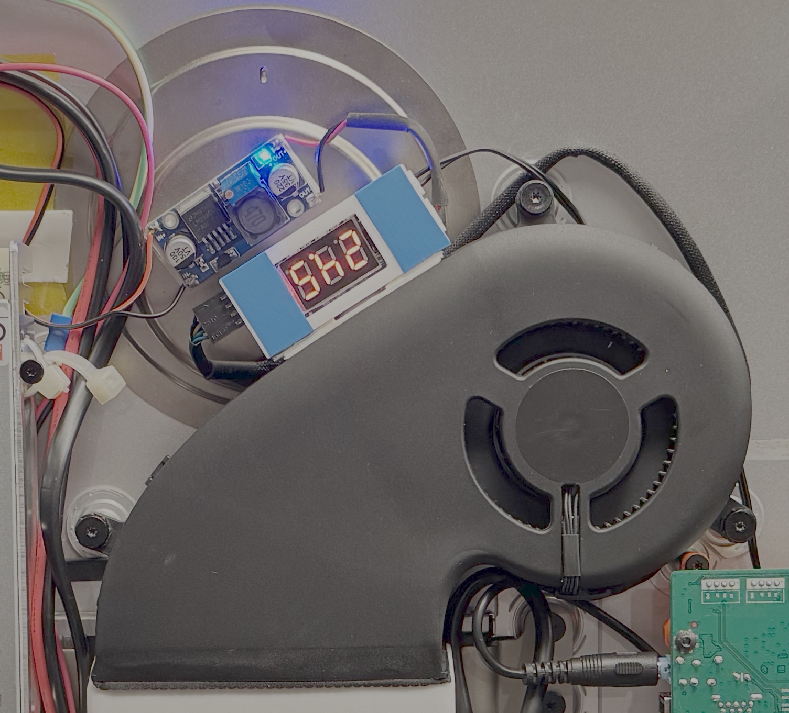

# iMac 27" (2017) DIY 5K Display Conversion


This page documents the conversion of a **27-inch iMac Retina (2017)** into a **standalone 5K display**.


What is special about this iMac conversion is the usage of an DSP (Digitla sound Processor) with amplifier to drive the internal sparkers. I also created a custom bracket to hold the DSP and the PSU saefly in place.

I tried to document all my conclusions and learnings as detaield as possible.
---

## Overview

* Panel: iMac 27" 5K (P3)
* Input: USB‑C + DisplayPort
* Power Delivery: up to 90 W
* Audio: Original iMac speakers via DSP (Bluetooth)
* Cooling: Original iMac fan with external controller

---

## What Works / What Does Not

### Working

* 5K output over USB‑C and DisplayPort
* 90 W USB‑C Power Delivery
* Manual brightness & full OSD
* USB 2.0 hub
* Bluetooth audio

### Not Working (Yet)

* Webcam
* Microphone
* Clean audio over USB‑C (noise issue)

---

## Base Hardware

### iMac

* **Model:** iMac 27" Retina (2017)
* **Cost:** ~200 € (used)

Why this model:

* Native 5K panel
* P3 color gamut
* Widely available and increasingly cheap

---

## Display Electronics

### Display Driver Board

* **Model:** StoneTaskin JRY‑W9RQUHD‑SA1
* **Cost:** ~160 €

Key reasons for choosing this board:

* Native 5K over USB‑C
* 90 W USB‑C Power Delivery
* Stable firmware and OSD support

Alternative considered:

* StoneTaskin R1811 (rejected due to price)

#### Mounting

* Custom 3D‑printed mount
* Secured with screws (no adhesive)

**3D print:**

* [https://www.thingiverse.com/thing:7263432](https://www.thingiverse.com/thing:7263432)

#### Wiring

* The backlight cable should not to be plugged in the wronw way. I had to make shure the side of the connector with the red wire is connected with the grey wire.

* The display cable is very fragile and needs extra caution during display mounting as with this DriverBoard alignment, the cable is on the shorter size.


---

## Power System

### Power Supply Unit (PSU)

* **Model:** Mean Well LRS‑200‑24
* **Output:** 24 V / 200 W

Why this PSU:

* Handles sustained 90 W USB‑C load
* No shutdown under peak current
* No audible coil noise

Previously tested:

* LRS‑150‑24 (rejected: OCP trips + noise)

#### Notes

* Original iMac AC inlet reused

#### Mounting

* Combined PSU + DSP carrier

**3D print:**

* [https://www.thingiverse.com/thing:7266647](https://www.thingiverse.com/thing:7266647)


---

## Cooling System

### Components

* **Fan:** Original iMac fan
* **Buck Converter:** LM2596S (24 V → 12 V)
* **Fan Controller:** 12 V PWM temperature controller

Purpose of each part:

* PSU outputs 24 V
* Fan requires stable 12 V
* Controller provides temperature‑based PWM

---

### Fan Wiring Reference

#### iMac Original Fan Connector

(Viewed from fan side)

```
Pin 1: +12 V
Pin 2: GND
Pin 3: TACH (RPM)
Pin 4: PWM (Control)
```

#### Fan Controller Output Header

(Top view)

```
Pin 1: GND
Pin 2: +12 V
Pin 3: TACH
Pin 4: PWM
```

⚠️ **Important:**

* Buck converter must be adjusted to **12.0 V** before connecting the fan

#### Mounting

* Fan adapter integrated into RAM door

**3D print:**

* [https://www.thingiverse.com/thing:7100773](https://www.thingiverse.com/thing:7100773)



#### References

* Fan controller programming: [https://youtu.be/_3i0bwN56d8](https://youtu.be/_3i0bwN56d8)
* Internal iMac temperature discussion: [https://forums.macrumors.com/threads/diy-5k-monitor-success.2253100/post-34302622](https://forums.macrumors.com/threads/diy-5k-monitor-success.2253100/post-34302622)

---

## Audio System

### Design Goal

Reuse the **original iMac speakers** while achieving acceptable sound quality.

---

### Final Audio Architecture

* **DSP / Amplifier:** Wondom JAB4

  * ADAU1701 DSP
  * 4 × 30 W Class‑D
  * Bluetooth 5.0
* **Programmer:** Wondom ICP5

Audio path:

```
Bluetooth → JAB4 DSP → iMac Speakers
```

This effectively turns the display into a **Bluetooth speaker**.


---

### Known Audio Issue

* Analog audio output from SA1 driver board is **noisy**
* Noise persists even with grounding attempts
* USB‑C audio currently unusable

Ideas and suggestions welcome.

---

## External I/O & Controls

### Power Button / OSD / Ports

* USB‑C panel‑mount extension (30 cm)
* DisplayPort 1.4 panel‑mount extension

Mounted at the original RAM door opening.


---

## 3D Printed Parts (Summary)

* PSU + DSP mount

  * [https://www.thingiverse.com/thing:7266647](https://www.thingiverse.com/thing:7266647)
* Display driver board mount

  * [https://www.thingiverse.com/thing:7263432](https://www.thingiverse.com/thing:7263432)
* RAM door + fan adapter

  * [https://www.thingiverse.com/thing:7100773](https://www.thingiverse.com/thing:7100773)

---

## References & Inspiration

* MacRumors DIY 5K thread

  * [https://forums.macrumors.com/threads/diy-5k-monitor-success.2253100/](https://forums.macrumors.com/threads/diy-5k-monitor-success.2253100/)
* Snazzy Labs

  * [https://youtu.be/5q3SdtiLAPk](https://youtu.be/5q3SdtiLAPk)
* andisolo

  * [https://youtu.be/ABOH22fvRGs](https://youtu.be/ABOH22fvRGs)

---

## Safety Notice

⚠️ **Warning**

This project involves **mains voltage** and modified power electronics.

Proceed only if you understand electrical safety.
I take no responsibility for damage or injury resulting from this build.
