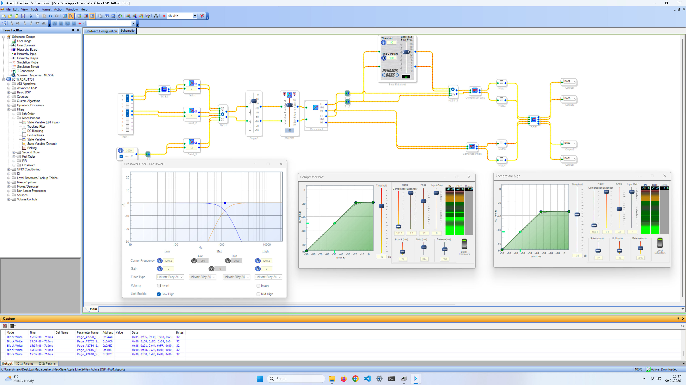

# iMac 27" (2017) DIY 5K Display Conversion

This project documents my conversion of a **27-inch iMac Retina (2017)** into a standalone **5K display**, inspired by the Apple Studio Display.

My main goal was to achieve a **clean, professional internal and external build**. Instead of using hot glue or double-sided tape, I designed and 3D-printed brackets to securely mount all components. Many of the used parts are publicly available on Thingiverse, while some were modified or were designed from scratch.

I’m open to receive suggestions, improvements, and ideas from the community.

---

## Features (Working)

- 5K 10-bit color display via **USB-C** and **DisplayPort**
- **90 W USB-C Power Delivery**
- Manual display brightness control
- USB 2.0 hub
- Sound via Bluetooth
- Full OSD control

---

## Limitations (Not Working Yet)

- Webcam
- Microphone
- Proper audio over USB-C (currently noisy)

---

## Parts Selection

Below is an overview of the selected components and the reasoning behind them.  
This does **not** claim to be the best possible setup—just what was available at a reasonable price at the time.

---

### iMac

- **Model:** iMac 27" Retina (2017)
- **Price:** ~200 € (used)

I bought a used 2017 iMac online. Prices are expected to drop further as Intel-based iMacs stop receiving macOS updates.  
The 2017 models are well suited because they already support the **P3 color gamut**.

---

### Display Driver Board

- **Model:** StoneTaskin JRY-W9RQUHD-SA1
- **Price:** ~160 €

This board supports:
- 5K resolution over USB-C
- 90 W USB-C charging

Another strong candidate was the **StoneTaskin R1811**, but I decided against it due to its higher price (~251 €).

### Power Button / OSD Remote

- The original iMac power button is reused
- Connected to the driver board’s remote button header
- The original OSD remote button was modified and placed inside the RAM door

This keeps the exterior appearance clean and close to the original iMac design.

---

### Power Supply Unit (PSU)

- **Model:** Mean Well LRS-200-24
- **Price:** ~24 € (AliExpress)

The original iMac AC power connector is reused.

Initially, I tried the **LRS-150-24**, which fits better mechanically, but:
- It shuts down under full 90 W USB-C load (overcurrent protection)
- It produced audible buzzing noise at low load

The 200 W version solved both issues.

---

### Speakers & Audio

This is where my build differs most from other conversions.

I wanted to reuse the **original iMac speakers**, as I always liked their sound quality.

#### Initial Attempts
- Direct audio output from the driver board
- Multiple passive crossovers (AliExpress)

Result: usable, but not satisfying.

#### Final Solution
- **Wondom JAB4 DSP & Amplifier Board**
  - 4 × 30 W Class-D amplifier
  - ADAU1701 DSP
  - Bluetooth 5.0
  - ~40 €
- **Wondom ICP5 Programmer**
  - Required for SigmaStudio programming
  - ~20 €

The DSP significantly improved sound quality.  
Currently, audio is transmitted via **Bluetooth**, effectively turning the monitor into a Bluetooth speaker.

⚠️ **Known issue:**  
The audio output of the SA1 driver board introduces noticeable noise when connected to the DSP.  
USB-C audio is therefore not usable yet. Any suggestions or ideas from the community are very welcome.

DSP programming is currently basic, but there is plenty of room for future improvement.

---

## 3D printed parts

- PSU + DSP https://www.thingiverse.com/thing:7266647
- Driver Board https://www.thingiverse.com/thing:7263432 remixed from https://www.thingiverse.com/thing:7044482
- RAM Door & Fan adapter https://www.thingiverse.com/thing:7100773